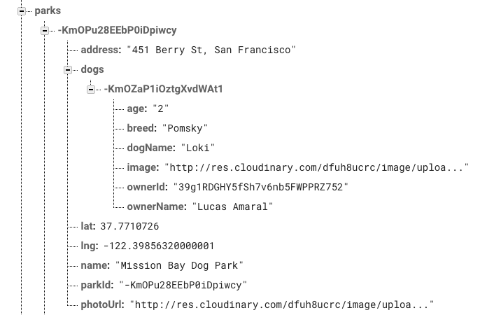

# Playtime

Every dog owner knows that the best way to tire out their dog is to let it play with other dogs. A tired dog is a happy dog. Playtime makes it easier to coordinate playtimes by enabling users to follow each other's dogs. When taking your dog out, let the app know and it will automatically alert all your dog's friends, so they can meet up and hang out. It's Playtime, all the time.

## Technologies

Playtime is built in React-Native using the Expo SDK. For our backend, we chose Firebase, a lightweight server maintained by Google. React-Native compiles to native code for both android and iOS, allowing us to create multi-platform apps using the JavaScript syntax we know and love. Expo, which is maintained by many core developers for React-Native, allows for fairly straightforward Facebook and Google Authentication schemes, as well as other benefits. Lastly, Firebase, as a 'real-time' database, listens for events (such as receiving or deleting data) which can trigger events on the client.

## Features

1. Users can create, view, follow and unfollow dogs.
2. Users can join and unfollow parks. Joining a park indicates to other users that your dogs go to that park.
3. Users can approve and deny follow requests.
4. Users can create playtimes, automatically alerting the users who follow their dogs and go to the same parks as them that they are now taking their dogs to the park.
5. Users can log in through their Facebook or Google accounts.

## Implementation

### Real-time updates

Firebase allows Playtime users to receive push notifications in real-time without a browser (or, in this case, app) reload. It creates the equivalent of an event-listener, which is triggered whenever a new notification is added to the database: when this happens, the list of notifications on the client is automatically updated.

```JavaScript
componentWillMount() {
  const currUID = FirebaseApp.auth().currentUser.uid
  const noteRef = FirebaseApp.database().ref(`users/${currUID}/notifications`);
  const _this = this;

  noteRef.on('value', snapshot => {
    _notifs = [];
    snapshot.forEach(notif => {
      if (notif.val().status === "UNSEEN") {
        _notifs.push(notif.val());
        _notifs[_notifs.length - 1].id = notif.key;
      }
    });
    _this.setState({
      notifications: _notifs,
      loading: false
    });
  });

  noteRef.on('child_removed', snapshot => {
    _this.state.notifications.forEach((notif, idx) => {
      if(notif.id === snapshot.key) {
        _this.state.notifications.splice(idx, 1);
        this.setState({notifications: _this.state.notifications});
      }
    });
  });
}
```

Here we see that, whenever the value of `noteRef` changes (and when the component mounts for the first time), Firebase triggers a new `snapshot`. This updates the current list of notifications with the new notifications. The reason we opt for `value` over `child_added` here is that, using `child_added`, which triggers once per child, we'd need to set the state once per child——an unnecessary number of re-renders. Even though listening on `value` becomes somewhat slower when a new notification is received, we reason that it's less likely a user will receive a new notification in real-time while on Playtime than that they'll have a large-ish array of notifications to go through on rebooting the app.

We then add a listener for `child_removed`, which will trigger whenever the client resolves a notification. This will iterate through the current notifications stored in `this.state.notifications` and splice out the notification with the correct id, triggering a real-time update.


### Structuring data for faster queries

NoSQL databases should be structured to answer certain questions as opposed to allowing unlimited freedom for random queries. As such, we built our Firebase data store to allow fast lookup of the data we knew we'd need to lookup frequently; the trade-off is that the database is structured in a highly specific and denormalized way. This makes rarer queries difficult and it also can slow down writes to the DB; fortunately, writes are far rarer than reads, so this isn't an issue.

The bonus is that we get to iterate down a path to grab exactly the data we need, fast. For instance, to look up all the dogs that go to a park, you just need to do `firebaseApp.database().ref('parks/${parkId}/dogs')`, as shown below:



Removing a dog is a bit more costly, since it must be removed from the park as well, but seriously, how often are users removing their dogs?


### Hacky push notifications

Firebase does not support push notifications in conjunction with Expo, so we built a small Rails server in order to handle pushes. It has one controller (tokens) with a single route:

```ruby
def create
  exponent.publish(
    exponentPushToken: params[:token],
    message: params[:message],
    data: {a: params[:message]}
  )

  render json: {success: true}
end
```

The Exponent SDK takes care of the rest. We send the message in the params object from the client, along with the id (represented by `params[:token]`) of the user who will receive the push.


## Further Improvements

Building an iOS app in a week is hard--that's one major takeaway from this project. So there's still lots of room for cool functionality, though we have a strong core in place:

### Joining Playtimes

It'd be nice if we could confirm with other users that we plan to meet them at the park, no? Users could 'accept' a playtime and even send invitations to each other.

### Android Rollout

Expo makes it easy to publish your app to Android as well as iOS, and so with some minor reworking of UI, this seems like an achievable task--opening Playtime up to a whole new cadre of dog lovers!

### More Dog-Related functionality

Going to the park is pretty essential for dog owners, but so are walks--what if we allowed owners to coordinate those, too? And there's already an app that connects vacationing dog-owners with potential dog-sitters--maybe we could jump into the market, too.
